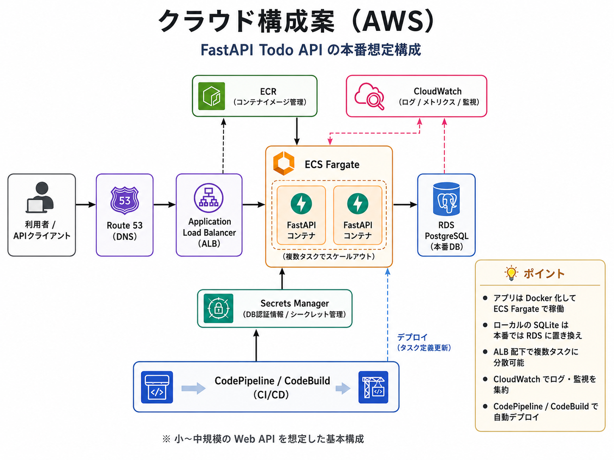

# クラウド構成案（AWS）

## 1. 概要

このドキュメントでは、FastAPI で実装された Todo API アプリケーションを AWS 上にデプロイする場合の構成案を整理します。

現在のアプリケーションは、ローカル開発環境では FastAPI と SQLite を利用しています。
本番環境では、SQLite ではなくマネージドな RDB を利用し、アプリケーションはコンテナ化して運用する想定です。

なお、私自身は実務でクラウドインフラをゼロから設計・構築した経験はありません。
そのため今回は、Web API をクラウド上で運用する際に必要となる構成要素を、リクエストの入口、アプリケーション実行環境、データベース、認証情報管理、ログ監視、デプロイ、可用性、スケーラビリティ、パフォーマンス、コストの観点に分解して整理しました。

---

## 2. 構成図



---

## 3. 想定構成

```text
利用者 / APIクライアント
  ↓
Route 53
  ↓
Application Load Balancer
  ↓
ECS Fargate / FastAPI コンテナ
  ↓
RDS PostgreSQL または MySQL
```

周辺コンポーネントとして、以下を利用します。

```text
ECR
Secrets Manager
CloudWatch
CodePipeline / CodeBuild
```

---

## 4. 各サービスの役割

### Route 53

Route 53 は DNS 管理に利用します。

たとえば `api.example.com` のようなドメインに対するアクセスを、Application Load Balancer に向ける役割を持ちます。

### Application Load Balancer

Application Load Balancer は、外部からの HTTP / HTTPS リクエストを受け取り、ECS Fargate 上で動作する FastAPI アプリケーションへ転送します。

複数のアプリケーションタスクが起動している場合には、リクエストを分散する役割も担います。

### ECS Fargate

ECS Fargate は、FastAPI アプリケーションを Docker コンテナとして実行するために利用します。

Fargate を利用することで、EC2 インスタンスを直接管理せずにコンテナを実行できます。
そのため、小〜中規模の Web API としては、運用負荷と拡張性のバランスが取りやすいと考えました。

### RDS PostgreSQL または MySQL

ローカル開発では SQLite を利用していますが、本番環境では複数のアプリケーションインスタンスから同時にアクセスされることを想定する必要があります。

そのため、本番では RDS PostgreSQL または MySQL を利用します。

RDS を利用することで、バックアップ、監視、Multi-AZ 構成などを AWS のマネージドサービスとして扱えます。

### ECR

ECR は、FastAPI アプリケーションの Docker イメージを保存するために利用します。

CI/CD でビルドしたコンテナイメージを ECR に push し、ECS Fargate がそのイメージを利用してアプリケーションを起動します。

### Secrets Manager

Secrets Manager は、DB 接続情報やシークレット値を管理するために利用します。

DB パスワードや秘密情報をソースコードに直接書かず、アプリケーション実行時に安全に参照する構成にします。

### CloudWatch

CloudWatch は、ログ、メトリクス、アラートの管理に利用します。

FastAPI アプリケーションのログ、ALB のメトリクス、ECS タスクの状態などを CloudWatch に集約することで、障害調査やパフォーマンス確認を行いやすくします。

### CodePipeline / CodeBuild

CodePipeline / CodeBuild は、ビルドとデプロイの自動化に利用します。

たとえば、コードが main ブランチにマージされたタイミングで CodeBuild が Docker イメージをビルドし、ECR に push します。
その後、ECS Fargate のタスク定義を更新してデプロイする流れを想定します。

---

## 5. この構成を選んだ理由

今回の FastAPI アプリケーションは Web API であり、Docker コンテナとして実行しやすい構成です。

そのため、以下の理由から ECS Fargate + RDS を中心とした構成を選びました。

* FastAPI アプリケーションをコンテナ化して管理しやすい
* EC2 を直接管理せずにアプリケーションを実行できる
* ALB 配下で複数タスクにリクエストを分散できる
* 本番DBとして RDS を利用できる
* CloudWatch でログやメトリクスを確認できる
* Secrets Manager により認証情報を安全に管理できる
* CodePipeline / CodeBuild によりデプロイを自動化できる

---

## 6. 可用性

可用性を高めるため、ECS Fargate のタスクは複数の Availability Zone に配置することを検討します。

また、RDS についても必要に応じて Multi-AZ 構成を利用します。

これにより、特定のタスクや Availability Zone に障害が発生した場合でも、サービス停止のリスクを下げることができます。

---

## 7. スケーラビリティ

アプリケーション側のスケールは、ECS Service Auto Scaling によって対応します。

CPU 使用率、メモリ使用率、リクエスト数などをもとに、FastAPI コンテナのタスク数を増減させます。

データベース側については、まずクエリやインデックスを見直します。
読み取り負荷が増えた場合には、Read Replica や Aurora への移行も検討します。

---

## 8. パフォーマンス

この Todo API において、主なパフォーマンス上の懸念はデータベースアクセスです。

特に、ユーザーごとのタスク一覧取得や、日付・完了状態による絞り込みが頻繁に行われる場合、適切なインデックス設計が重要になります。

具体的には、以下の観点を意識します。

* よく使われる検索条件に対してインデックスを設定する
* 不要な全件走査を避ける
* slow query を監視する
* 一覧取得では将来的にページネーションを検討する
* レスポンスサイズが大きくなりすぎないようにする

---

## 9. セキュリティ

セキュリティ面では、以下を考慮します。

* ALB で HTTPS を利用する
* ECS タスクや RDS は必要に応じて private subnet に配置する
* Security Group で通信元・通信先を制限する
* DB 接続情報は Secrets Manager で管理する
* API トークンやパスワードをログに出力しない
* 必要に応じて WAF を導入する
* 本番運用では API トークンの有効期限、再発行、失効管理、ハッシュ化保存を検討する

---

## 10. コスト

小規模なアプリケーションであれば、最初から大きな構成にしすぎないことも重要です。

コストを抑えるためには、以下を検討します。

* ECS タスク数を必要最小限にする
* RDS インスタンスサイズを小さく始める
* 不要な NAT Gateway 利用を避ける
* 初期段階では App Runner のような簡易構成も検討する

ECS Fargate + RDS は柔軟性がありますが、App Runner よりも設定項目が多く、初期構築の難易度は上がります。

---

## 11. 代替案

小規模かつシンプルに始める場合は、AWS App Runner も選択肢になります。

App Runner は、コンテナ化された Web アプリケーションを比較的少ない設定で公開できます。

一方で、ネットワーク構成、DB 接続、スケーリング、将来的な拡張性を細かく制御したい場合は、ECS Fargate の方が柔軟性があります。

そのため、以下のように比較します。

```text
App Runner:
- 構築が簡単
- 運用負荷が低い
- 小規模な初期構成に向いている

ECS Fargate:
- 設計の自由度が高い
- ネットワークやスケールの制御がしやすい
- 将来的な拡張に向いている
```

---

## 12. まとめ

今回の FastAPI Todo API を AWS にデプロイする場合、まずは以下の構成を基本案とします。

* Route 53 で DNS 管理
* Application Load Balancer でリクエストを受ける
* ECS Fargate で FastAPI コンテナを実行する
* RDS PostgreSQL または MySQL を本番DBとして利用する
* ECR でコンテナイメージを管理する
* Secrets Manager で認証情報を管理する
* CloudWatch でログ・メトリクスを監視する
* CodePipeline / CodeBuild で CI/CD を構築する

この構成は、小〜中規模の Web API を想定した基本構成として、可用性、スケーラビリティ、運用性、コストのバランスを取りやすいと考えています。
